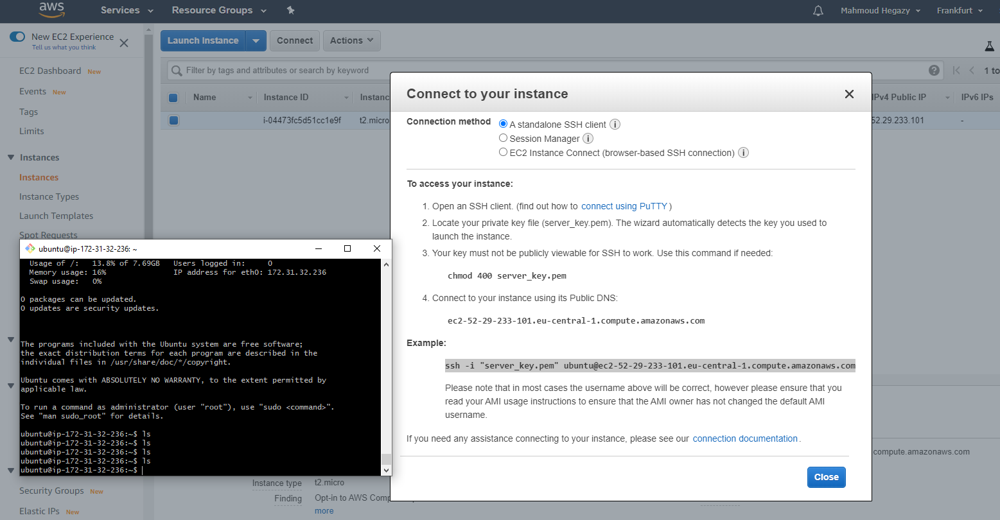

## important links

1.  https://docs.aws.amazon.com/AmazonRDS/latest/UserGuide/CHAP_Tutorials.WebServerDB.CreateWebServer.html
2.  https://docs.aws.amazon.com/AWSEC2/latest/UserGuide/add-repositories.html

first time install use : sudo apt update and sudo apt upgrade
then sudo apt install yum

# EC2
How to use EC2 part 0

EC2 IP
52.29.233.101

## Connection method
A standalone SSH client 
Session Manager 
EC2 Instance Connect (browser-based SSH connection) 

----------------------------------------------------

## To access your instance:
Open an SSH client. (find out how to connect using PuTTY)
Locate your private key file (server_key.pem). The wizard automatically detects the key you used to launch the instance.
Your key must not be publicly viewable for SSH to work. Use this command if needed:
chmod 400 server_key.pem
Connect to your instance using its Public DNS:
ec2-52-29-233-101.eu-central-1.compute.amazonaws.com

----------------------------------------------------

# Example:
ssh -i "server_key.pem" ubuntu@ec2-52-29-233-101.eu-central-1.compute.amazonaws.com
Please note that in most cases the username above will be correct, however please ensure that you read your AMI usage instructions to ensure that the AMI owner has not changed the default AMI username.


## without putty



## check how many repo, and add new repo
*  Command
```code
sudo yum-config-manager --add-repo https://github.com/MahmoudHegazi/May_Front_End_Geeks
```


